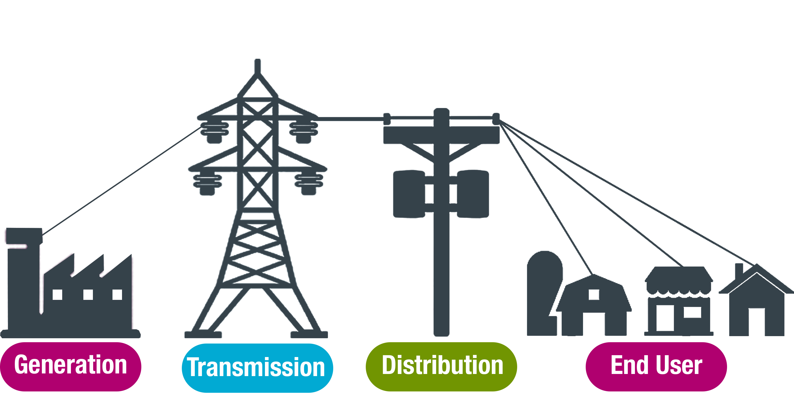

# Churn Analysis: BCG-Virtual-Experience-Program
Open Access Data Science and Advanced Analytics Virtual Experience Program built and endorsed by BCG on Forage
 

## Background
`<Company Name>` is a major gas and electricity utility that supplies to corporate, SME (Small & Medium Enterprise), and residential customers. The power-liberalization of the energy market in `<Country>` has led to significant customer churn, especially in the SME segment. They have partnered with BCG to help diagnose the source of churning SME customers.
 

### Client's Hypothesis
One of the hypotheses under consideration is that `churn` is driven by the `customers’ price sensitivities` and that it is possible to predict customers likely to churn using a predictive model. The client also wants to try a discounting strategy, with the head of the SME division suggesting that offering customers at high propensity to churn a 20% discount might be effective.

### Scope
The Lead Data Scientist (LDS) held an initial team meeting to discuss various hypotheses, including churn due to price sensitivity. 
After discussion with your team, you have been asked to go deeper on the hypothesis that the churn is driven by the customers’ price sensitivities. 

## Work Breakdown

* ### [Task-1](Task-1/task-1-email_to_LDS):
  Formulate the hypothesis as a data science problem and lay out the major steps needed to test this hypothesis. 
  Communicate thoughts and findings in an email to LDS, focusing on the potential data that is required from the client and analytical models you would use to test such a hypothesis.

* ### Task-2:
  Perform some exploratory data analysis. Look into the data types, data statistics, and identify any missing data or null values, and how often they appear in the data. 
  Visualize specific parameters as well as variable distributions. 
  Clean the data – address missing values, duplicates, data type conversions, transformations, and multicolinearity, as well as outliers.
  

## Copyright
 ©. All Rights Reserved.
